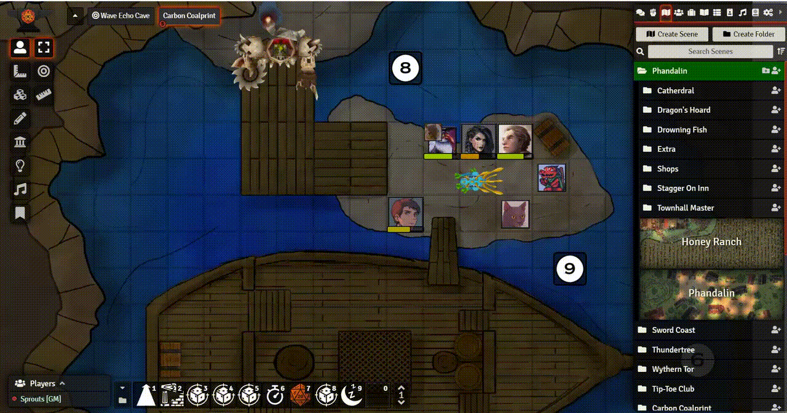

)].download_count&url=https%3A%2F%2Fapi.github.com%2Frepos%2FEriku33%2FFoundry-VTT-Image-Hover%2Freleases)
# Image-Hover (https://foundryvtt.com/packages/image-hover/)

* **Author**: Eriku#2108 (Discord)
* **Version**: 2.0.1 (Scheduled for release)
* **Foundry VTT Compatibility**: 9+ (Release 1.1.8 is compatible with previous versions of Foundry VTT)
* **System Compatibility**: dnd5e and most others but have not checked.
## Installation
To install, search for Image Hover in the module list or follow these instructions:

1.  Inside Foundry, select the Game Modules tab in the Configuration and Setup menu.
2.  Click the Install Module button and enter the following URL: https://github.com/Eriku33/Foundry-VTT-Image-Hover/releases/latest/download/module.json.

## Description
A module built on top of the Foundry Virtual Tabletop API that allows users to hover over actor tokens and see the character art.
User must be on the token layer to see the character art, if no character art exists (default icon), token art is used instead. 
Image hover also supports animated file types that Foundry allows.  

## Settings

### Required actor permission
Setting for game masters to configure the required actor ownership to see character art. 
Default: None - All users can hover over any token and see art.
### Art on hover
Choose the type of artwork shown for tokens when hovered. 
Default: Character art
##### Character art - Character art when possible.
##### Token art - Token art only.
##### Token art if wildcard - Token art if actor is wildcard(random image), otherwise character art.
##### Token art if unlinked - Character art for linked tokens only, otherwise token art.
### Enable/Disable Image Hover
Each user can disable the module. 
Default: On
### Position of Image
Each user can relocate the cahracter art to a different corner of the screen (Bottom left/right and Top left/right) 
Default: Bottom Left
### Image to monitor width
Each user can configure the size of the image based on the width of their monitor. 
Default: 7 - Image will take up 1&frasl;7th of your screen.
### Hover delay 
Each user can add a hover time requirement before image shows up. 
Default: 700 (0.7 seconds).

## Set a keybind requirement while hovering a token
If a keybind is set in Game settings-Configure controls, that key will be required to be pressed while hovering over a token to see the art. 
If no keybind is set, art will be shown on token hover.

## Hide art for specific token (Game master only)
If Hide Image Hover Art checkbox is ticked, art will not be shown to anyone on hover. 

